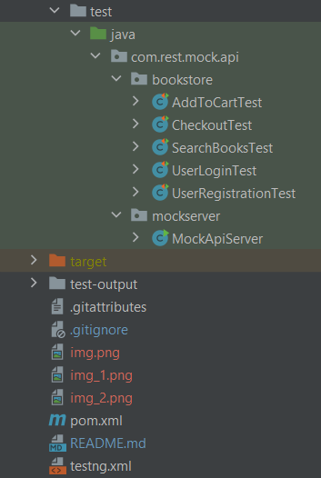

**<h2>Mock Rest-API Automation Framework:**</h2>

This is a comprehensive API automation framework designed for testing the mock REST APIs of a hypothetical online bookstore. 
The framework leverages Java for programming, WireMock for creating mock APIs, Rest Assured for testing the APIs, Maven for build automation, TestNG for test assertions, Faker API for generating test data,
Lombok library for reducing the boilerplate code and Extent Report for generating detailed test reports.

****Requirements: ****
* Java Development Kit (JDK) 11 or higher 
* Rest-assured version 5 or higher 
* Apache Maven 3.3 or higher 
* wiremock-standalone 3.0.1 or higher 
* Java faker API version 1.0.2 or higher 
* TestNG 3.7 or higher
* Extent reports 3.1.3 or higher 
* An IDE like IntelliJ IDEA or Eclipse 
* Lombok Java library 1.18.20 or higher 

 

****Framework Structure:****

* **base**:This package consists of all the reusable methods which common and reusable throughout the framework

* **requestBuilder**:This package consists of the requestBuilder(RequestBody) methods for different API requests

* **responseParser**:This package consists of the response validation methods for the different APIs.

* **utils**: This package consists of all the utilities which are common and reusable throughout the framework

* ****resources:****

    * **config.properties** It contains the base urls, different environments and different APIs endpoints.

  * **testData**:It contains the input test Data(.csv) files

  * **RequestResponseSchema.json**:It contains the API request and response specifications/schemas jsons.

* **test**: It contains all the Success and Error test case scenarios.

* **mockserver**: This package contains MockApiServer class for invoking the mock service to execute the tests.

* **pom.xml**: It contains all the required dependencies and libraries to run the project.

* **testng.xml**: It contains all the tests/packages to be run in the test suite.

 

 

****How to run test cases:****

1. Clone the repository(https://github.com/devqa07/MockAPIAutomationFramework.git) from GitHub
2. Open the IDE(IntelliJ or Eclipse) and open/import the project
3. **Run/start the mock-server from test->mockserver->MockApiServer**
4. From Terminal run the command **mvn clean install** or run the complete test suite from testng.xml 
5. Wait for the test execution completion and then navigate to test-output folder and open the MOCK-API-AutomationReport.html in any browser for detailed test report

 

****test-output:****

Execution Reports(open MOCK-API-AutomationReport.html in a browser to see the detailed report), the report looks as follows: 
  
  

****Steps for Manual Execution from Postman:****
* Download and Install Postman from https://www.postman.com/downloads/
* Open Postman and click on Import->select the json file([BookStoreMockAPIs.postman_collection.json](..%2F..%2FMyStuff%2FActual%2FBookStoreMockAPIs.postman_collection.json)) and execute the different API requests.

